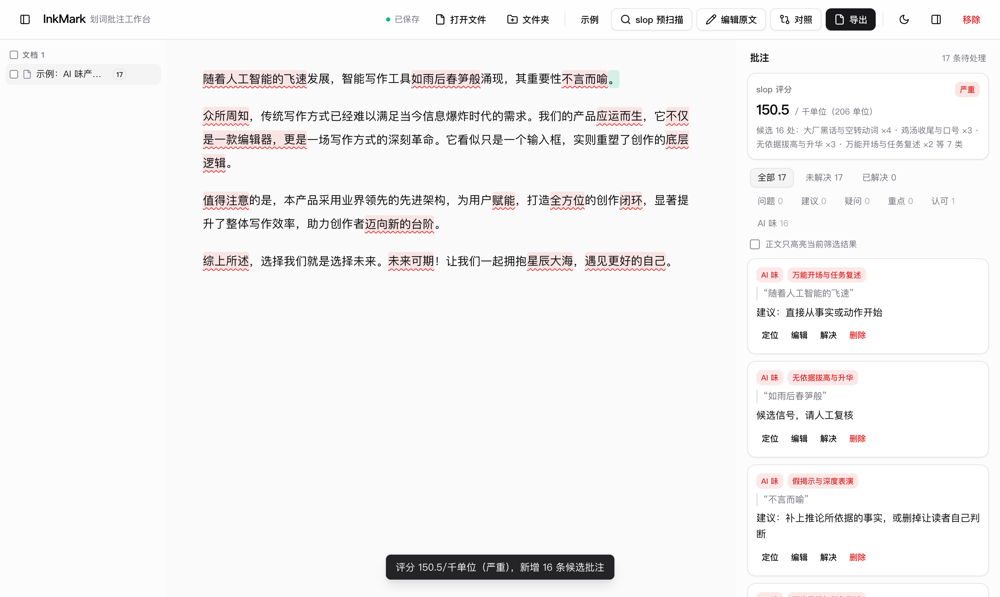
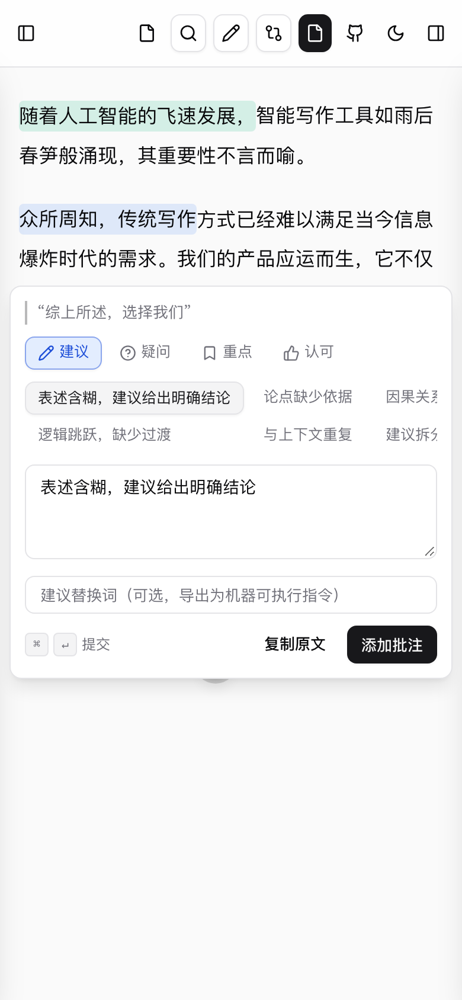
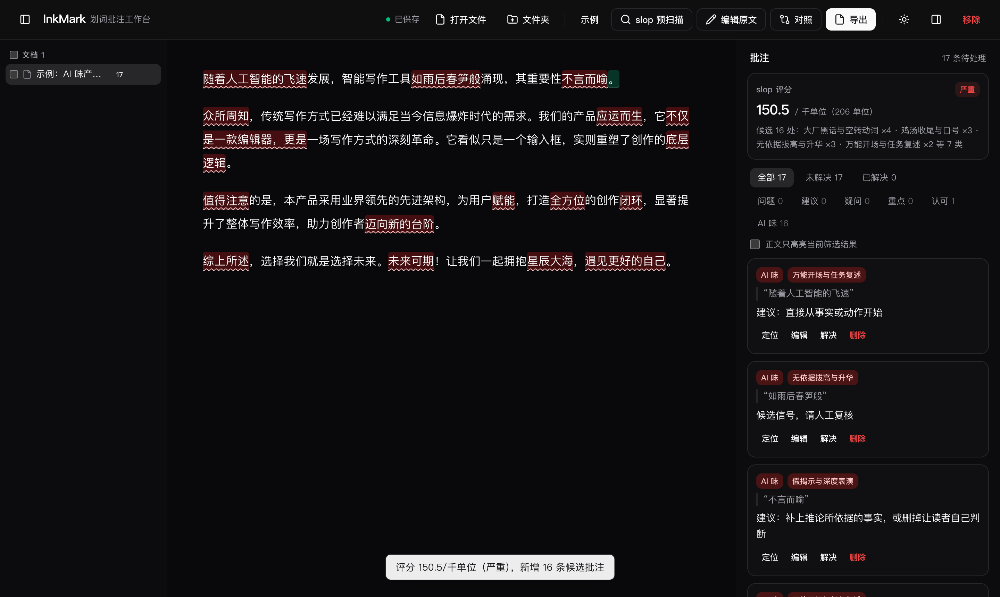

<div align="center">

English · [简体中文](README.md)

<picture>
  <source media="(prefers-color-scheme: dark)" srcset="https://signature4u.vercel.app/api/sign?text=InkMark&font=great-vibes&bg=transparent&fontSize=190&speed=1.4&fill=gradient&f1=e2e8f0&f2=7dd3fc" />
  
</picture>

**Inline annotation workbench** — annotate AI-revised text right where it hurts, and hand “what's wrong, and where” back to the AI.

[](https://github.com/YuniqueCore/inkmark/actions/workflows/deploy.yml)
[](https://github.com/YuniqueCore/inkmark/releases)


**[Open the app →](https://yuniquecore.github.io/inkmark/)**



| Mobile · composer (two-row chips, horizontal scroll) | Desktop · dark theme |
| --- | --- |
|  |  |

</div>

---

The UI follows the shadcn/ui design language (Tailwind CSS v4 + design tokens, inspired by rareui): neutral zinc base, hairline borders, subtle shadows, light & dark themes (toggle in the header, follows system preference, persisted in localStorage). The production bundle is ~52KB gzipped — pure frontend, no backend.

## Features

- **Select-to-annotate**: select text in the document → a pin pops up at the cursor → hover to expand the composer card → pick a kind (suggestion / question / highlight / praise) → tap quick-phrase chips (capped at two rows, horizontally scrollable) or just type. Annotations stay on the text as colored highlights. **Draft protection** — stray clicks or the mouse wandering off never destroy what you're writing; drafts are keyed per passage and restored when you reselect (Esc is the only explicit discard). Cards and popups follow their anchor on scroll/resize, and scrolling inside the card never closes it.
- **Search & batch annotate (⌘F)**: a VSCode-style search panel — matches get outlined in the text live as you type (stacking with annotation backgrounds, WYSIWYG), Enter / ‹ › jump between hits; pick a kind and quick phrases, optionally a **suggested replacement**, then annotate every occurrence of the same content in one click (with a cross-document toggle covering the whole workspace). The sidebar aggregates them into a single card (occurrence count + expandable per-occurrence edit / jump); resolve or delete the whole group at once. Replacements ride along the three text exports as machine-executable directives (`→ 替换为「…」`). The panel never re-renders its own nodes on input, so IME composition is never interrupted.
- **Edit the source + robust anchoring**: edit the canonical text in place; afterwards every annotation re-anchors automatically — exact quote relocation (with prefix/suffix disambiguation), and a line-level diff shift clamps annotations onto the edited boundary. Annotations are never lost to edits; lost anchors get a visible marker (amber squiggle in the text, a “lost anchor” badge in the sidebar/popup) that clears itself once the quote returns.
- **Diff view**: paste the AI's revision to get a line-level track-changes diff (Myers algorithm, graceful degradation for huge edits); **both sides are annotatable** — source-side annotations pin to modified lines, revision-side annotations pin to added lines (tagged in the sidebar), and clearing the revision cleans up after itself.
- **Three export formats** (header button or ⌘/Ctrl+S): every annotation carries `@start-end` character offsets (0-based, end-exclusive, aligned with the W3C position selector) so machines can locate it precisely; download filenames are prefixed with the source document name (`chapter-3-批注-snippets-2026-09-28.md`):
  1. **Source + annotations**: full text with inline `【批注①·…】` markers inserted at each anchor;
  2. **Snippets + annotations**: each annotated passage listed with its annotations;
  3. **Review block**: Markdown quote format, paste it straight back to your AI agent.
  Copy or download as .md; resolved annotations are excluded by default (opt-in); a “file info” switch stamps the source file name on top — handy with multiple documents (W3C JSON stays standards-compliant).
- **W3C Web Annotation import / export**: export annotations as standard Annotation JSON (TextQuoteSelector + TextPositionSelector); on import, quotes are re-anchored automatically (position mismatch → full-text search → prefix/suffix disambiguation) and anything that can't be anchored is skipped explicitly — never mis-anchored. Opening a .json file imports it.
- **Slop pre-scan**: ships with the [anti-slop-kit](https://github.com/YuniqueCore/natural-talk) lexicons (169 zh / 212 en entries); one click marks boilerplate candidates with red squiggles and prefills annotations for human review. The pipeline mirrors `slop_check.py`: protected regions (code fences / inline code / URLs / emails), regex flags, overlap dedupe before cluster/density escalation; **identical scoring** (w / cluster_w / density_w weights, score = evidence weight per kilo-unit, clean / light / noticeable / heavy); **score history** persists per document (last 20 samples) with deltas and a mini trend line in the stats card.
- **Document tree with bulk actions**: multi-select documents (select all supported), bulk export (pick a format once → copy everything or download a zip, duplicate names auto-numbered) or bulk delete (with confirmation); each tree row also has a hover export button, so you never need to switch documents just to export.
- **Annotation management**: sidebar list with kind/status filters, locate / edit / resolve / delete, and confirmation on every destructive action. After a scan, the sidebar shows a **slop score card**: band badge (clean / light / noticeable / heavy) + score per kilo-unit + category distribution, invalidated and re-scanned when the text changes.
- **Responsive layout**: three-pane desktop at ≥lg (drag to resize); below lg, single pane with left/right **drawers** (document tree / annotation list slide over, dismissed by backdrop or Esc); the header condenses to icons on small screens; composer, popups and the export modal are all clamped inside the viewport, with dvh heights for mobile browser chrome. `public/device-test.html` is a self-check page that runs scripted assertions at three real device sizes.
- **Autosave**: localStorage; sessions can also be exported/imported as JSON (pick a .json file to import).
- **Light / dark theme**: one-click toggle; an inline first-paint script applies the preference with no flash.

## Quick start

```bash
git clone --recurse-submodules https://github.com/YuniqueCore/inkmark.git
bun install        # or npm install
bun run dev        # dev server
bun run build      # typecheck + build to dist/
bun run test       # vitest unit tests (pure core + component logic)
bun run test:e2e   # Playwright screenplay browser suite (uses system Chrome)
```

> The lexicons come from the [natural-talk](https://github.com/YuniqueCore/natural-talk) submodule (`skill/`) — clone with `--recurse-submodules`, or run `git submodule update --init` in an existing checkout.

## Testing

Two layers, each with a clear job:

- **vitest (tests/)**: pure core functions and component logic (draft ledger, IME guards, export / import / re-anchoring).
- **Playwright screenplay (e2e/)**: real browser behavior, layered after the Screenplay pattern —
  `abilities/` (drive the page) → `screens/` (semantic locator contracts) → `interactions/` (atomic actions) →
  `tasks/` (business workflows) → `questions/` (read-only state queries); assertions live only in `e2e/specs/`.
  Key coverage: composer-card stability while operating its own controls (scrolling chips, typing, blur),
  the annotation popup in edit mode, the export modal, bulk tree actions, and mobile drawer exclusivity.

## Structure

```
src/
  core/          pure-function core, DOM-free, fully testable
    types.ts     domain types (annotations, lexicon schema)
    text.ts      canonical text blocks, snippets, W3C TextQuoteSelector
    anchors.ts   annotation ranges → render segments (scanline)
    export.ts    the three export formats
    diff.ts      line-level Myers diff (revision view)
    reanchor.ts  re-anchoring after source edits (quote re-anchor + diff shift fallback)
    w3c.ts       W3C Web Annotation import / export with robust re-anchoring
    slop.ts      lexicon scan: protected regions / dedupe / cluster / density
  ui/            DOM layer (editor / selection / sidebar / exporter / storage)
  skill/         natural-talk submodule — single source of truth for lexicons:
                 skill/references/anti-slop-kit/scripts/data/{zh,en}.json
tests/           vitest specs
e2e/             Playwright screenplay suite (abilities/tasks/questions/specs)
```

Design constraint: **the canonical text is the single source of truth** — annotations store only `[start, end)` offsets; core never touches the DOM or storage; localStorage is the only IO boundary. The source text is read-only while annotating, so offsets never drift (in-place editing is a future feature that brings robust anchoring with it).

## Known limits & roadmap

- [ ] Export a standalone diff review report for the revision view (revision-side annotations currently fold into the three export formats with a “revised” tag)

---

<div align="center">

The header signature is generated on the fly by [animated-sign-4u](https://github.com/YuniqueUnic/animated-sign-4u)’s `/api/sign` endpoint (animated SVG · transparent background · light/dark palettes).
To make your own, open the editor with `?bg=transparent` → **[signature4u.vercel.app/editor](https://signature4u.vercel.app/editor?bg=transparent)**

</div>
